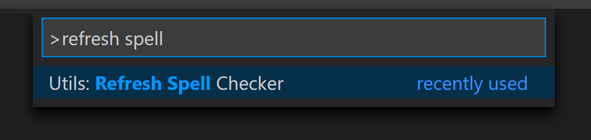
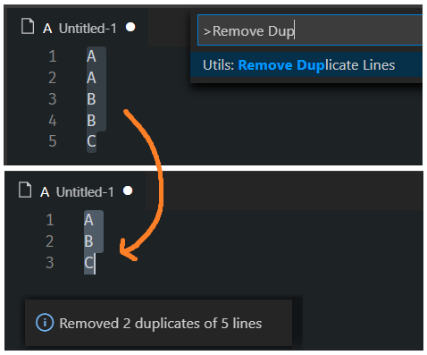

# [VS Utils](https://marketplace.visualstudio.com/items?itemName=KyleMit.vs-utils)

Some grab bag utilities I, KyleMit, find helpful for VS Code - download and suggest updates if that's your thing.

## Features

### Refresh Spell Checker

Run Disable Spelling and Enable Spelling back to back in order to Refresh Spelling

**Note**: Must have [**Code Spell Checker**](https://marketplace.visualstudio.com/items?itemName=streetsidesoftware.code-spell-checker) by Street Side Software installed in order to refresh

### Remove Duplicate Lines

Remove Duplicate Lines from selected text

## Documentation

* [Changelog](https://github.com/KyleMit/vs-utils/blob/master/CHANGELOG.md)
* [Backlog](https://github.com/KyleMit/vs-utils/blob/master/BACKLOG.md)
* [Contributing](https://github.com/KyleMit/vs-utils/blob/master/CONTRIBUTING.md)
